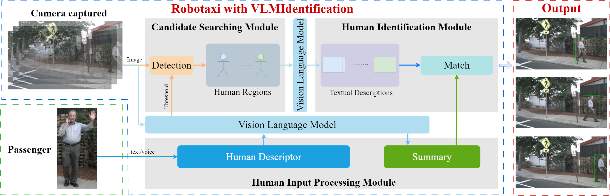

<p align="center">

  <h1 align="center">Enhancing Robotaxi Pick-up through Vision-Language-Model-Based Passenger Identification</h1>
  <p align="center">
    <a href="https://fanwu66.github.io/"><strong>Fan Wu</strong></a>
    ·
    <a href="https://imce.sspu.edu.cn/2024/0517/c5124a156030/page.psp"><strong>Shaojing Song</strong></a>
    ·
    <a href="https://jxxy.sspu.edu.cn/2025/1024/c5247a165417/page.htm"><strong>QingE Wu</strong></a>
    ·
    <a href=""><strong>Zhiqing Miao</strong></a>
    ·
    <a href=""><strong>Xiang Sun</strong></a>
    ·
    <a href="https://cyberc3.sjtu.edu.cn/people.htm"><strong>Hanyang Zhuang</strong></a>

  </p>


<h2 align="center">T-ITS 2025</h2>
  <div align="center">
    
  </div>

<p align="center">
  <br>
    <a href="https://pytorch.org/get-started/locally/"></a>
    <a href="https://pytorchlightning.ai/"></a>
    <br></br>
    <a href="">
      
    </a>
  </p>
</p>


# News
- [2024/11/26] We release the code of VLMIdentification.
- [2023/11/13] VLMIdentification got accepted to IEEE T-ITS. 🎉


# Getting Started

- [Installation](docs/install.md)
- [Prepare Dataset](docs/prepare_dataset.md)

Run VLMIdentification
```
python main.py
```

# Acknowledgment
This project is not possible without the following codebases.
* [YOLOv10](https://github.com/THU-MIG/yolov10)
* [Qwen-VL](https://github.com/QwenLM/Qwen-VL)

# Citation
If you use VLMIdentification in your research, please cite our work by using the following BibTeX entry:
```
@inproceedings{wu2025vlmidentification,
    title={Enhancing Robotaxi Pick-up through Vision-Language-Model-Based Passenger Identification},
    author={},
    booktitle={},
    month = ,
    year={}
}
```
